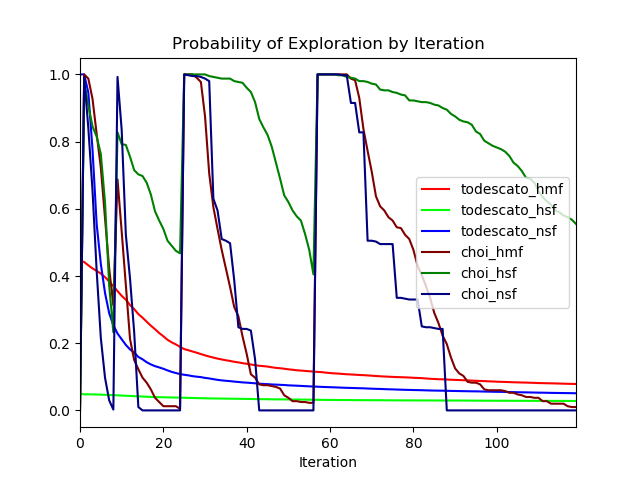

# australia3

Learning + Coverage simulation based on real-world
[Kaggle dataset](https://www.kaggle.com/carlosparadis/fires-from-space-australia-and-new-zeland)
of satellite-observed wildfire locations within Australia. Agents must
*learn* the geospatial distribution of wildfires,
then *cover* areas with respect to the distribution.

#### Hyperparameters

- Agents: 4
- Iterations: 120
- Runs per Algorithm: 100
- Algorithms: Todescato, Choi
- Fidelities: Null-prior SFGP, Human-prior SFGP, Human-prior MFGP
- Number of Configurations: 2 algorithms x 3 fidelities = 6
- Number of Prior Points: 121 grid-spaced at every 0.1 in unit square

#### Data

- Sourced from [fire_archive_M6_96619.csv](../Kaggle/AustralianWildfires/fire_archive_M6_96619.csv)
- Filtered by date to 2019-08-01
- Filtered by longitude in [115, 125], latitude in [-35, -29]
- Lon/Lat coordinates normalized to unit square and used to fit KDE model
- KDE model used to predict density at 0.02 resolution grid on unit square
- Hifi data taken from KDE predictions + iid N(0, 0.1) noise
- Lofi data taken from KDE predictions at 2x bandwidth + iid N(0, 0.25) noise
- 10% of data from each fidelity saved to use to train GP hyperparameters
    - [MFGP Hyperparameters (log-scaled)](australia3_mf_hyp.csv)
    
    |mu_lo|s^2_lo|L_lo|mu_hi|s^2_hi|L_hi|rho|noise_lo|noise_hi|
    |---|---|---|---|---|---|---|---|---|
    |0.30632738255657677|-2.2844822421786146|-0.6828871782945511|-0.007637936566648297|-3.82306537242193|-1.8282993756656656|-0.5377241285119335|-2.821156165254181|-4.687873305436609|

    - [SFGP Hyperparameters (log-scaled)](australia3_sf_hyp.csv)
    
    |mu_sf|s^2_sf|L_sf|noise_sf|
    |---|---|---|---|
    |0.001|-2.368468757|-1.353149618|-4.596652374|

    
- 121-point grid at each 0.1 from Lofi used to create human prior

#### Runtime:
- Todescato Human MF: ~4 hrs
- Todescato Human SF: ~2 hrs
- Todescato Null SF: ~2 hrs
- Choi Human MF: ~16 hrs
- Choi Human SF: ~8 hrs
- Choi Null SF: ~10 hrs

#### Discussion
- Results seem to be much smoother when averaged over 100 simulations
    - Followed lead of Todescato paper in which they run 100 simulations
- Adding more agents may make plots smoother
    - Try n = 8 following Todescato paper
- Too many human prior points?
    - Led posterior variance to be too low to lead to meaningful learning
    - Lofi prior was "too good" - see below
    - Choi algorithms needed to sample ~300 pts in final period to half the variance
    - Reducing sample noise at hifi and increasing sample noise at lofi
    may help solve this problem
- Computed loss incorrectly
    - Added noise directly to hifi grid when generating, and used this noisy
    hifi as ground truth when computing loss
    - Need to ensure the generation of three grids in future: ground
    truth (noiseless), hifi (low noise) and lofi (high noise)
        - Ground truth (noiseless) will be used to compute loss
        - Hifi (low noise) will be used when agents take samples
        - Lofi (noiseless) will be used to give human prior
- Lofi was "too good" of a proxy to lead to meaningful learning
    - Increase bandwidth smoothing?
    - Add greater lofi sample noise?
    - Use gridded maxpooling to generate lofi?
    - Consider negative-correlation case in future work to contrast approaches
- Simulations took ridiculously long
    - Todescato bottleneck: computation of kernel function on grid
    - Choi bottleneck: search for variance-reduction points and TSP tour
    computation
    - Use cprofiler to pinpoint slow portions of algorithms
    - Look into 
    [multiprocessing](https://medium.com/python-experiments/parallelising-in-python-mutithreading-and-mutiprocessing-with-practical-templates-c81d593c1c49)
    to simultaneously simulate on all cores
    - Look into
    [numba](http://numba.pydata.org/)
    to increase simulation speed
    - Look into other ways to utilize GPU in computation
    - Consider other hyperparameters that affect computational burden:
        - Greater sample noise leads to greater number of samples needed in
        Choi leads to greater computational time on path planning
        - Greater number of simulations take longer - try 25, 50 before 100
        - Greater number of human prior points reduces variance further and
        forces greater sampling in Choi, leading to greater computational
        time when path planning
    - Consider looking into HPCC resources

    
#### Plots
    

#### Follow-up
- Implemented multiprocessing parallelization with good results
- See [simulator_multiproc.py](../simulator_multiproc.py) implementation
- Tested with todescato_nsf and choi_nsf at 120 iterations with 4 repeats and yielded

| Multiprocessing Time | Standard Time |
| --- | --- |
| 1034.8s | 1770.5s|