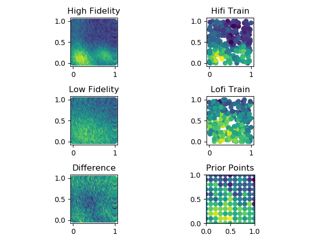

# australia3

Learning + Coverage simulation based on real-world
[Kaggle dataset](https://www.kaggle.com/carlosparadis/fires-from-space-australia-and-new-zeland)
of satellite-observed wildfire locations within Australia. Agents must
*learn* the geospatial distribution of wildfires,
then *cover* areas with respect to the distribution.

#### Hyperparameters

- Agents: 4
- Iterations: 120
- Runs per Algorithm: 100
- Algorithms: Todescato, Choi
- Fidelities: No-prior SFGP, Human-prior SFGP, Human-prior MFGP
- Number of Configurations: 2 algorithms x 3 fidelities = 6
- Number of Prior Points: 121 grid-spaced at every 0.1 in unit square

#### Data

- Sourced from [fire_archive_M6_96619.csv](../Kaggle/AustralianWildfires/fire_archive_M6_96619.csv)
- Filtered by date to 2019-08-01
- Filtered by longitude in [115, 125], latitude in [-35, -29]
- Lon/Lat coordinates normalized to unit square
- Normalized Lon/Lat coordinates used to fit KDE model
- KDE model used to predict density at 0.02 resolution grid on unit square
- Hifi data taken from KDE predictions + iid N(0, 0.1) noise
- Lofi data taken from KDE predictions at 2x bandwidth + iid N(0, 0.25) noise
- 10% of data from each fidelity saved to use to train GP hyperparameters
- 121-point grid at each 0.1 from Lofi used to create human prior

#### Results

- Runtime: