# australia5

Learning + Coverage simulation based on real-world
[Kaggle dataset](https://www.kaggle.com/carlosparadis/fires-from-space-australia-and-new-zeland)
of satellite-observed wildfire locations within Australia. Agents must
*learn* the geospatial distribution of wildfires,
then *cover* areas with respect to the distribution.

#### Hyperparameters

- Agents: 8
- Iterations: 240
    - Choi doubling trick follows 16 * 2 ** i, hence 16 + 32 + 64 + 128 = 240
- Runs per Algorithm: 32
    - Quad-core multiprocessing is optimized with a multiple of 4 runs
- Algorithms: Todescato, Choi, Lloyd
- Fidelities: Null-prior SFGP, Human-prior SFGP, Human-prior MFGP
- Number of Configurations: 2 learning algorithms x 3 fidelities + lloyd = 7
- Number of Prior Points: 36 grid-spaced at every 0.2 in unit square

#### Data

- Sourced from [fire_archive_M6_96619.csv](../Kaggle/AustralianWildfires/fire_archive_M6_96619.csv)
- Filtered by date to 2019-08-01
- Filtered by longitude in [115, 125], latitude in [-35, -29]
- Lon/Lat coordinates normalized to unit square and used to fit KDE model
- KDE model used to predict density at 0.02 resolution grid on unit square
- Hifi data taken from KDE predictions + iid N(0, 0.1) noise
- Lofi data taken from KDE predictions at 4x bandwidth + iid N(0, 0.25) noise
- 10% of data from each fidelity saved to use to train GP hyperparameters
    - [MFGP Hyperparameters](australia5_mf_hyp.csv)
    
    |mu_lo|s^2_lo|L_lo|mu_hi|s^2_hi|L_hi|rho|noise_lo|noise_hi|
    |---|---|---|---|---|---|---|---|---|
    |0.2363|0.1574|0.6772|-0.1008|0.03480|0.1970|0.5533|0.05809|0.0098

    - [SFGP Hyperparameters](australia5_sf_hyp.csv)
    
    |mu_sf|s^2_sf|L_sf|noise_sf|
    |---|---|---|---|
    |0.2952|0.0951|0.2396|0.0099
    
    - Trained SFGP Hyperparameters **solely on hifi data**
        - Equivalent to the assumption that human data is as reliable as
        and described by the same hyperparameters as machine data would be

    
- 36-point grid at each 0.2 from Lofi used to create human prior

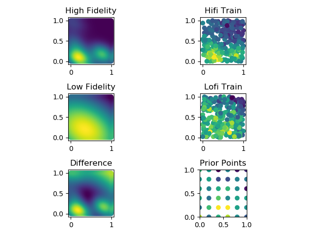

#### Runtime

- Logged in [australia5_output.txt](australia5_output.txt)

|Algorithm|Total Time (s)|Mean Time/Simulation (s)
|---|---|---|
|Todescato Null SF|4060.84|126.90|
|Todescato Human SF|4036.77|126.15|
|Todescato Human MF|7196.97|224.91|
|Choi Null SF|10955.88|342.37|
|Choi Human SF|52648.77|1645.27|
|Choi Human MF|10634.66|332.33|
|Lloyd|139.84|4.37|
|Total|89673.83|400.32|

#### Discussion
- Results not as smooth as 100 simulation run, but mediocre
- Results smoother with n = 8 agents over n = 4 agents
- Too many human prior points?
    - 36 points is certainly better than 121 in australia3
    - Consider trying 25 points at each 0.25 in unit square
    - Led Choi algorithms to get hung up on sampling when halving variance
    - Reducing sample noise at hifi and increasing sample noise at lofi
    may help solve this problem
- Fixed hifi/lofi generation and saving to exclude noise, and added
noise *only* when training hyperparameters and taking measurements in algorithms
- Fixed regret computation by subtracting off **min loss of Lloyd** from
each algorithm before cumulative-summing
    - Before, the min loss of each algorithm was subtracted off, meaning
    that if an algorithm reached a high-loss steady-state algorithm
    very quickly, it would have near-zero regret
    - Regret is now computed with respect to the best-case configuration
- Consider alternative methods of lofi construction
    - Increase bandwidth smoothing? Currently set to 4x hifi
    - Add greater lofi sample noise?
    - Use gridded maxpooling to generate lofi?
    - Use SVD matrix compression to generate lofi?
    - Consider negative-correlation case in future work to contrast approaches
- Simulations were much faster with multiprocessing, but we still have room for improvement
    - Approached 100% CPU utilization with multiprocessing
    - Todescato bottleneck computation of kernel function on grid is already optimized with Numpy
    - Choi bottleneck: search for variance-reduction points and TSP tour
    computation
        - In Choi Human Single Fidelity, over 700 sample points were taken
        to reduce variance beneath the final halved threshold!
        - See [australia5_choi_hsf_sample.csv](australia5_choi_hsf_sample.csv)
        - Need to prioritize accelerating this simulation in particular
    - Use cProfiler to pinpoint slow portions of algorithms
    - Consider looking into HPCC resources or other remote workstation options
- Added 95% CI shaded regions around mean on plots using std. error
    - _mu of xbar +- 2*(stddev of xbar)/sqrt(n)_
- Added simulation timing to quantify performance
    - Still need to automate timing logging to CSV file for quick processing
    - Current approach just prints to console
    - Potentially useful to consider including in paper
    - Algorithmic time complexity and computational burden should be 
    considered when choosing a swarm algorithm, especially if
    computational costs scale with the number of agents
    
#### Performance
    
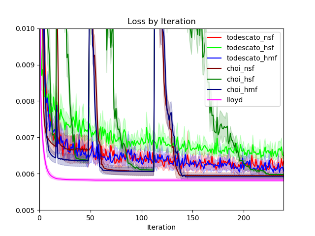

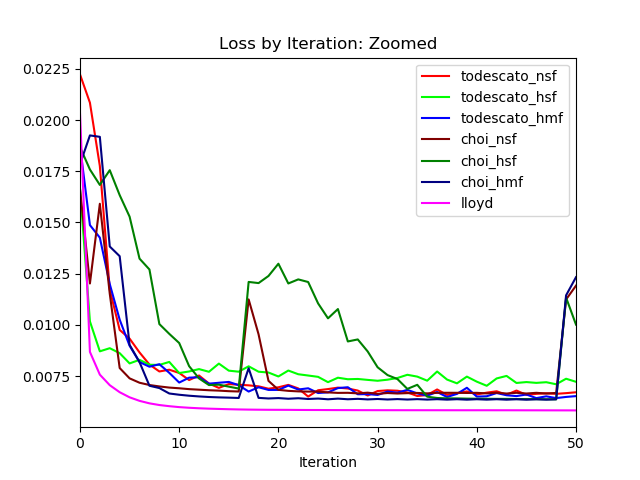

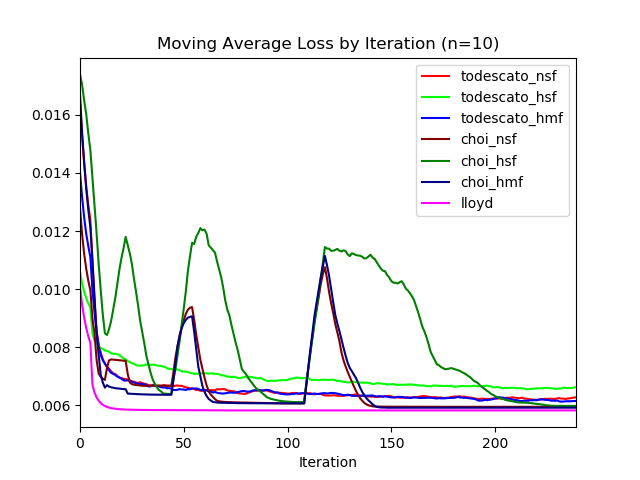

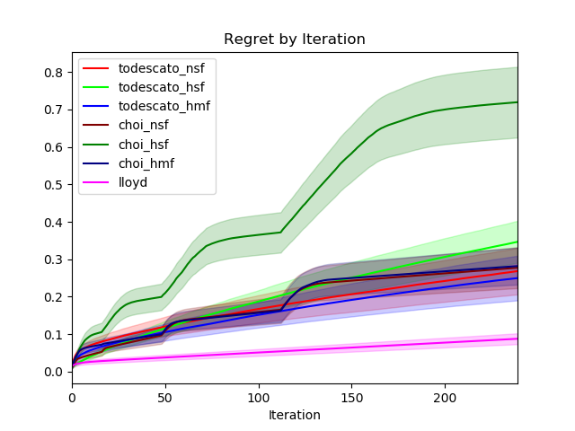

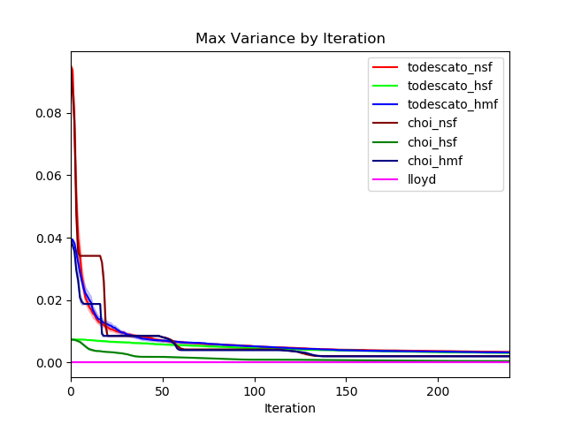

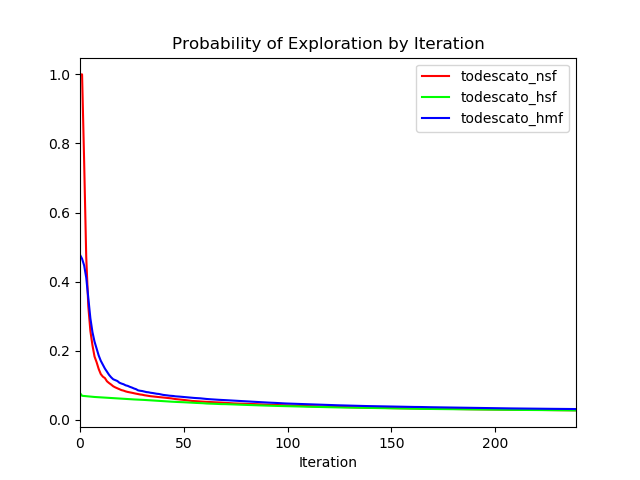

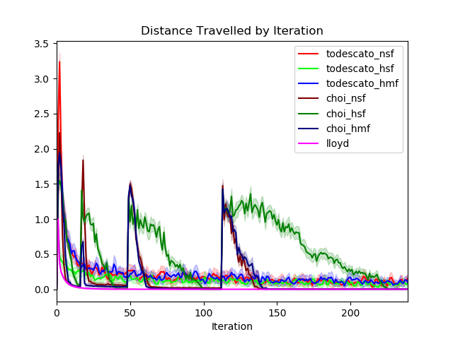

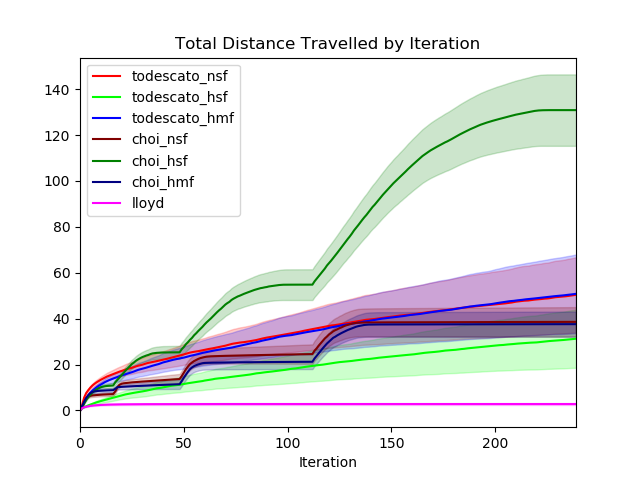

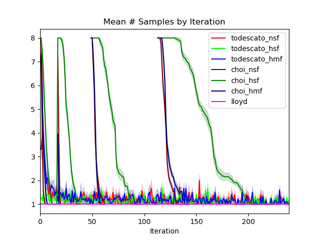

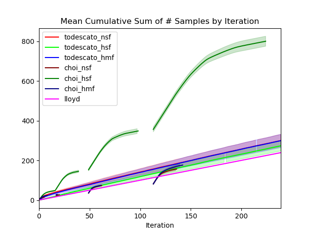

#### Configurations

- Todescato Null SF

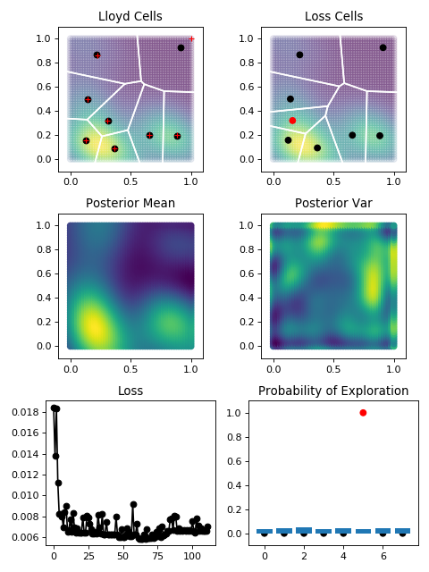

- Todescato Human SF

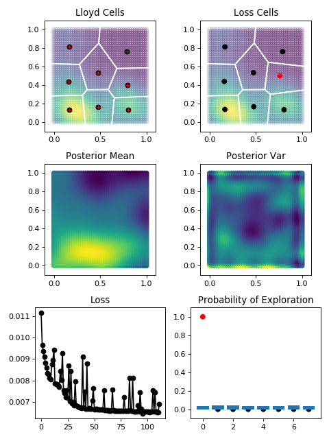

- Todescato Human MF

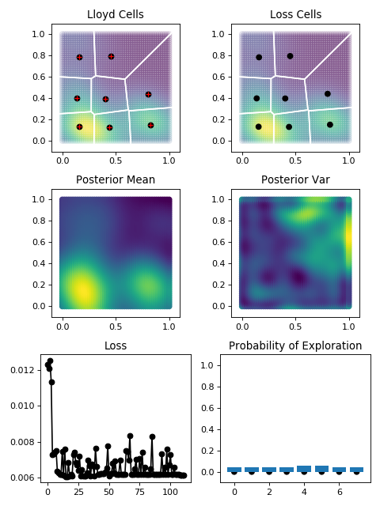

- Choi Null SF

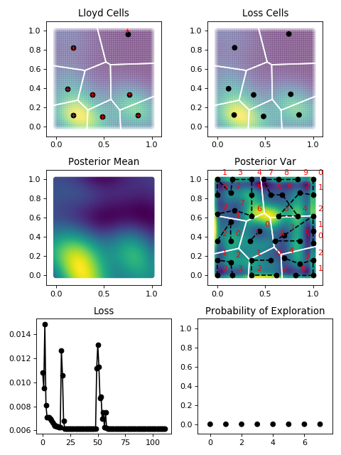

- Choi Human SF

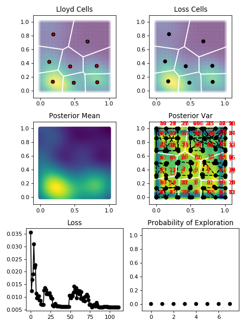

- Choi Human MF

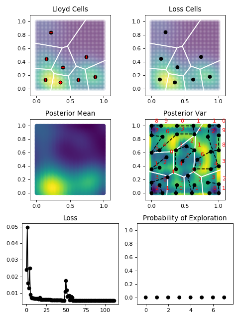

#### Follow-up

- Discuss at 6/30 research meeting