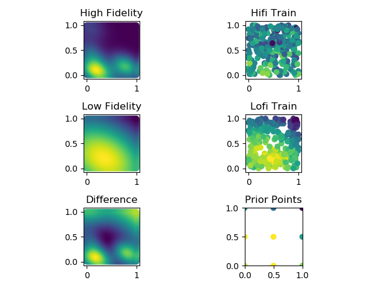
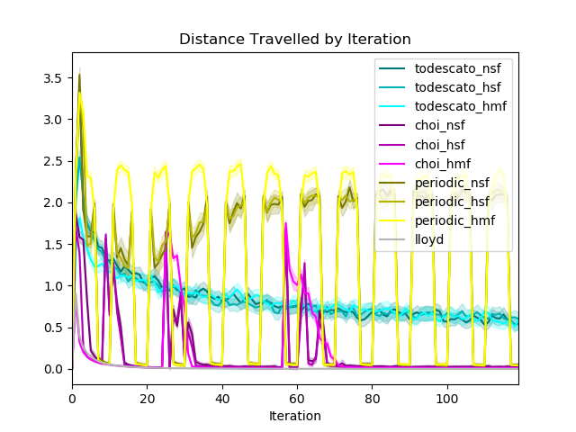
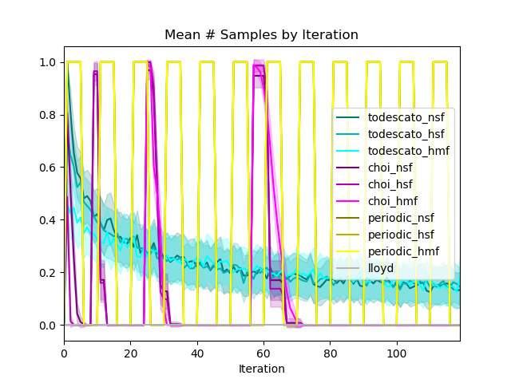

# australia7

Learning + Coverage simulation based on real-world
[Kaggle dataset](https://www.kaggle.com/carlosparadis/fires-from-space-australia-and-new-zeland)
of satellite-observed wildfire locations within Australia. Agents must
*learn* the geospatial distribution of wildfires,
then *cover* areas with respect to the distribution.

#### Major Changes
- Changed Choi algorithm to begin reducing the variance from the same
starting baseline value in all cases
- Changed Choi algorithm to reduce variance by 1/sqrt(2) each time, instead
of 1/2
- Added Periodic algorithm with T=5 to compare with Todescato paper
- Set Lofi noise to be near zero (std. dev. 0.05) but increased Hifi
noise to be great (std. dev. 0.5) such that prior Lofi information is biased
but precise, while sample Hifi information is accurate but noisy
- Changed hyperparameter tuning of GP classes to use log-scaling
in order to be consistent with the rest of the hyperparameters
- Changed color scheme of plots to assist visibility and readability
- NEXT: attempt with uncorrelated prior, negatively correlated prior

#### Hyperparameters

- Agents: 8
- Iterations: 120
    - Choi doubling trick follows 8 * 2 ** i, hence 8 + 16 + 32 + 64 = 120
- Runs per Algorithm: 100
    - Quad-core multiprocessing is optimized with a multiple of 4 runs
- Algorithms: Todescato, Choi, Periodic, Lloyd
- Fidelities: Null-prior SFGP, Human-prior SFGP, Human-prior MFGP
- Number of Configurations: 3 learning algorithms x 3 fidelities + Lloyd = 7
- Number of Prior Points: 9 grid-spaced at every 0.5 in unit square

#### Data

- Sourced from [fire_archive_M6_96619.csv](../Kaggle/AustralianWildfires/fire_archive_M6_96619.csv)
- Filtered by date to 2019-08-01
- Filtered by longitude in [115, 125], latitude in [-35, -29]
- Lon/Lat coordinates normalized to unit square and used to fit KDE model
- KDE model used to predict density at 0.02 resolution grid on unit square
- Hifi data taken from KDE predictions + iid N(0, 0.5) noise
- Lofi data taken from KDE predictions at 4x bandwidth + iid N(0, 0.05) noise
    - Idea is for Lofi data to be _reliably_ biased with low noise, while
    Hifi (sampling) data is _unbiased_ with _high_ noise
- 10% of data from each fidelity saved to use to train GP hyperparameters
- [MFGP Hyperparameters](australia7_mf_hyp.csv)

|mu_lo|s^2_lo|L_lo|mu_hi|s^2_hi|L_hi|rho|noise_lo|noise_hi|
|---|---|---|---|---|---|---|---|---|
|0.182518611|0.142649808|0.734035897|3.1843E-07|0.02585443|0.267775273|0.485901978|0.002666622|0.253677944

- [SFGP Hyperparameters](australia7_sf_hyp.csv)
    
|mu_sf|s^2_sf|L_sf|noise_sf|
|---|---|---|---|
|0.333152514|0.051167216|0.452081359|0.255999898|
    
- Trained SFGP Hyperparameters **solely on hifi data**
    - Equivalent to the assumption that human data is as reliable as
    and described by the same hyperparameters as machine data would be

- 9-point grid at each 0.5 from Lofi used to create human prior
    - Idea is that Lofi prior is scare in availability but of extremely
    high precision
    - Assumes that although biased, Lofi data is trustworthy

#### Runtime

- Forgot to log, but significantly improved over previous simulations
    - Fixing the Choi algorithm such that variance was reduced from the
    same starting line in every simulation made computation much faster
    - Fixing the Choi algorithm to reduce variance by 1/sqrt(2) instead of
    by 1/2 on each period helped
- Approximately 13 hours in total across all 7 simulation types, 100 iterations of each

#### Discussion
- Results far smoother with 100 iterations - keep this standard moving forward
- n = 8 agents seems to be a good balancing number for now - keep it
- Human prior points?
    - 9 seemed to provide a good balance when it came to balancing
    the over-informative and under-informative prior cases
    - 9 is logical when it comes to the real-world problem set up: human
    observations (or hifi in general) are scarce, biased, but of high
    precision and correlated with the true mean
- Consider alternative methods of lofi construction
    - Increase bandwidth smoothing? Currently set to 4x hifi
    - Add greater lofi sample noise?
    - Use gridded maxpooling to generate lofi?
    - Use SVD matrix compression to generate lofi?
    - Consider negative-correlation case in future work to contrast approaches
- Simulation runtimes greatly improved
    - Add a runtime logging option
    - Approached 100% CPU utilization with multiprocessing
    - Use cProfiler to further pinpoint slow portions of algorithms
    - Consider looking into HPCC resources or other remote workstation options
    
#### Performance
    

- As expected, Periodic performs poorly and Lloyd excels with perfect knowledge
- Appears as though Choi doubling trick beats Todescato all the way
- Appears as though MF model beats SF model consistently, and that
both models with human prior beat no human prior

- Normalized WRT minimum loss configuration of Lloyd as zero
- Appears as though Choi doubling trick beats Todescato on all fronts
- The power of the MF model and human prior in general is captured here
most succinctly: smart early moves by the swarm are critical to minimizing
total regret since loss is highest at the beginning of Lloyd's algorithm,
and incorrect moves early on "cost" more

- Changed Choi algorithm to reduce by 1/sqrt(2) and normalize by the same
starting constant
- Need to reduce faster to stay on pace with Todescato? 
    - Appear to be within a constant of one another...

- As noted before, Choi is much more efficient in motion: if the swarm is
deployed in an environment in which motion is expensive, this is a 
strength to point out and consider
- Across the fidelities, each algorithm seems to be clustered tightly

- Note: this is the mean number of samples/cumulative number of samples
by Iteration **PER AGENT** in each chart.
    - With n = 8 agents, then, approximately 80 samples were taken by Choi
    and 200 by Todescato
- This plot is directly reflective of the posterior variance plot - Choi
sampled less but did not reduce the variance as far
    - Perhaps include some heuristic/algorithm for choosing
    a doubling rate of Choi which matches Todescato's posterior variance
    trend for given probability of exploration function F?

#### Configurations

- Bias in posterior mean estimate is most obvious in SF with human input
- Bias in posterior mean estimate is most obvious in SF with human input
- Bias in posterior mean estimate is near zero in SF without human input

- Todescato Null SF

- Todescato Human SF

- Todescato Human MF

- Choi Null SF

- Choi Human SF

- Choi Human MF

#### Follow-up

- Discuss at 7/7 research meeting