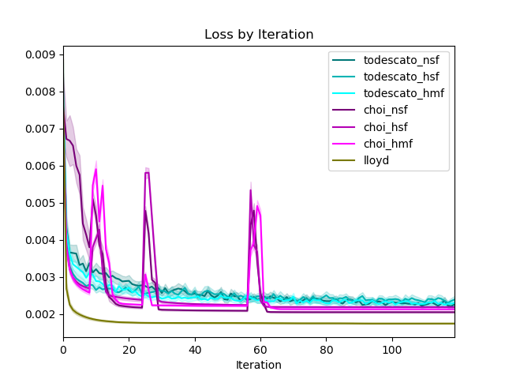
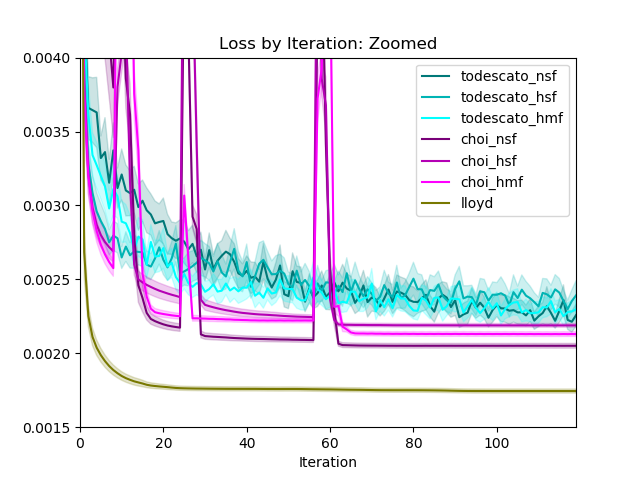
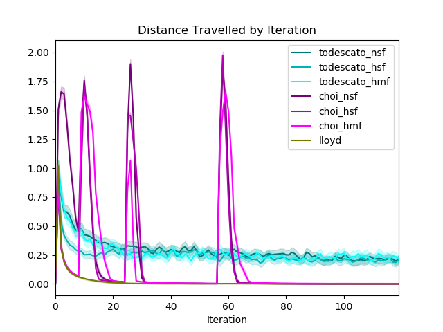
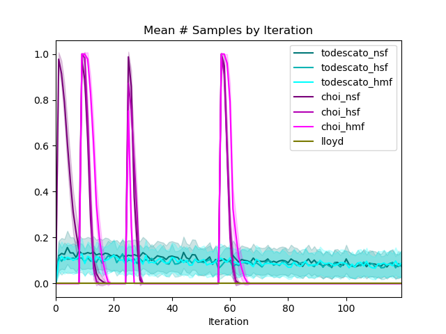
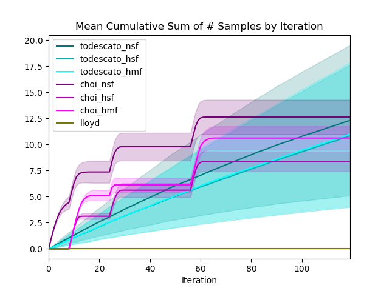

# australia9.1

Learning + Coverage simulation based on real-world
[Kaggle dataset](https://www.kaggle.com/carlosparadis/fires-from-space-australia-and-new-zeland)
of satellite-observed wildfire locations within Australia. Agents must
*learn* the geospatial distribution of wildfires,
then *cover* areas with respect to the distribution.

#### Major Changes

- Changed Todescato prob_explore calculation to _M / (M_0 * n)_ where *M*
is the max posterior variance, *M_0* is the initial max posterior variance,
and *n* is the number of agents in the environment
    - Ensures the amount of samples taken is normalized by the number of
    agents present, a problematic phenomenon beforehand
    - Makes simulations with larger swarms more feasible - runtime increases
    with the number of samples taken, and this new method of setting
    prob_explore will shorten large-swarm runtime
- Changed Choi max-variance-reduction-threshold-multiplier to 0.9 in order
to match max posterior variance between the two algorithms
- NEXT:
    - Lower the epsilon value in distribution.py that sets a minimum
    nonzero weight for each point such that robots are driven more toward
    function peaks
    - Simulate with 16 agents
    - Simulate with different distributions
    - Simulate with incorrect-prior distributions

#### Hyperparameters

- Agents: 8
- Iterations: 120
    - Choi doubling trick follows 8 * 2 ** i, hence 8 + 16 + 32 + 64 = 120
- Runs per Algorithm: 100
    - Quad-core multiprocessing is optimized with a multiple of 4 runs
- Algorithms: Todescato, Choi, Lloyd
- Fidelities: Null-prior SFGP, Human-prior SFGP, Human-prior MFGP
- Number of Configurations: 2 learning algorithms x 3 fidelities + Lloyd = 7
- Number of Prior Points: 36 grid-spaced at every 0.2 in unit square (inclusive)

#### Data

- Sourced from [fire_archive_M6_96619.csv](../Kaggle/AustralianWildfires/fire_archive_M6_96619.csv)
- Filtered by date to 2019-08-01
- Filtered by longitude in [115, 125], latitude in [-35, -29]
- Lon/Lat coordinates normalized to unit square
- Exponential basis function summation model used to
predict density at 0.02 resolution grid on unit square
    - Constructed by summing exponential basis functions centered
    at each point of a fire, then normalizing this sum
- Hifi data taken with basis function lengthscale 0.01 and iid N(0, 0.1) noise
    - Hyperparameters for sigma_n manually specified/overridden
- Lofi data taken with basis function lengthscale 0.25 and iid N(0, 0.01) noise
    - Hyperparameters for sigma_n manually specified/overridden
- 10% of data from each fidelity saved to use to train GP hyperparameters
    - Mean, sigma_f and lenscales trained; sigma_noise set manually
- [MFGP Hyperparameters](australia9_mf_hyp.csv)

|mu_lo|s^2_lo|L_lo|mu_hi|s^2_hi|L_hi|rho|noise_lo|noise_hi|
|---|---|---|---|---|---|---|---|---|
|0.086199098|0.096520401|0.526840224|1.13745E-07|0.026148492|0.102158238|0.21201403|0.01|0.1

- [SFGP Hyperparameters](australia9_sf_hyp.csv)
    
|mu_sf|s^2_sf|L_sf|noise_sf|
|---|---|---|---|
0.097423285|0.030695918|0.106751775|0.1
    
- Trained SFGP Hyperparameters **solely on hifi data**
    - Equivalent to the assumption that human data is as reliable as
    and described by the same hyperparameters as machine data would be
- 36-point grid at each 0.2 from Lofi used to create human prior
    - Idea is that Lofi prior is scare in availability but of extremely
    high precision
    - Assumes that although biased, Lofi data is trustworthy

#### Runtime

- Logged in [australia9.1_output.txt](australia9.1_output.txt)

|Algorithm|Total Time (s)|Mean Time/Simulation with Multithreading (s)
|---|---|---|
|Todescato Null SF|2304.153|23.04|
|Todescato Human SF|2419.17|24.19|
|Todescato Human MF|4276.26|42.76|
|Choi Null SF|9942.05|99.42|
|Choi Human SF|7398.83|73.98|
|Choi Human MF|11100.25|111.00|
|Lloyd|186.79|1.867|
|Total|37627.66|53.75|

#### Discussion
- Exploring less and exploiting more _did_ give advantage to having prior
    - Less sampling --> information is more valuable
    - Majority of computational bottleneck in Choi is sample planning;
    reducing the amount of exploration will speed everything up
- Matched posterior variance of Todescato to Choi
for a fairer comparison; continue this
- Human prior points?
    - 36 gives a more uniform coverage than 9, and makes more sense in
    the context of 8 agents
    - Spaced every 0.2 is 10x spacing of test points at 0.02
- Consider alternative methods of lofi construction
    - Increase bandwidth smoothing? Currently set to 4x hifi
    - Add greater lofi sample noise?
    - Use gridded maxpooling to generate lofi?
    - Use SVD matrix compression to generate lofi?
    - Consider negative-correlation case in future work to contrast approaches
- Runtime notes
    - Add a runtime logging option to save runtimes to CSV
    - Use cProfiler to further pinpoint slow portions of algorithms
    - Consider looking into HPCC resources or other remote workstation options
    
#### Performance
    

- MF model appears to perform the best overall
- HSF outperforms NSF early on by virtue of biased but approximately
correct prior information, but NSF outperforms HSF in the long run
as it incorporates no biased information
- Promising results - what I expected to see early on

- Normalized WRT minimum loss configuration of Lloyd as zero
- Given that each algorithm now reaches approximately the same level
of posterior variance at the end, regret is comparable between algorithms
- MF model of each algorithm has lowest regret, followed by HSF then NSF
    - Again, proves the notion that good decisions early make a big impact 

- Adjusted Choi threshold reduction scaling constant such that Choi
algorithms would reduce the variance as much as Todescato algorithms

- As noted before, Choi is much more efficient in motion: if the swarm is
deployed in an environment in which motion is expensive, this is a 
strength to point out and consider
    - See http://nodes.ucsd.edu/sonia/papers/data/2007_AK-SM-cdc.pdf
- Across the fidelities, each algorithm seems to be clustered tightly, though
HSF is the most confident and thus samples and travels the least

- Note: this is the mean number of samples/cumulative number of samples
by Iteration **PER AGENT** in each chart.
    - With n = 8 agents, then, approximately 10 * 8 = 80 samples were taken
- Interesting observation: Choi took slightly fewer cumulative samples in the 120 iterations,
 but reduced posterior variance slightly further than Todescato
    - Implies Choi is more efficient in motion and information gain?
    - Pre-planning helps each of these efficiencies

#### Configurations

- Todescato Null SF

- Todescato Human SF

- Todescato Human MF

- Choi Null SF

- Choi Human SF

- Choi Human MF

#### Follow-up

- Discuss at 7/7 research meeting