# australia9

Learning + Coverage simulation based on real-world
[Kaggle dataset](https://www.kaggle.com/carlosparadis/fires-from-space-australia-and-new-zeland)
of satellite-observed wildfire locations within Australia. Agents must
*learn* the geospatial distribution of wildfires,
then *cover* areas with respect to the distribution.

#### Major Changes

- Constructed density function as sum of exponential bases instead of
KDEs
    - More control over lengthscale than in KDE
    - Made high-fidelity lengthscale even shorter than before to make
    coverage "harder" to accomplish well
- Increased # prior points back to 36
    - 9 simply wasn't enough to give useful prior information
- Manually tuned GP hyperparameters to have sigma_n = 0.1
    - Previously, I'd been adding noise to the training data and assuming
    the hyperparameters converged to match when training, but the sample
    noise hyperparameter estimate tended to converge very low (no noise)
    - For example, when adding sigma_n = 0.5 white noise to training data
    in australia7, sigma_n only converged to 0.25
- Changed Todescato explore/exploit decision probability from (M / M_0) to
(M / M_0)^2, where M is max posterior uncertainty and M_0 is initial max
uncertainty
    - Encourages more exploration
- Changed Choi algorithm to roughly match the same level of exploration
as Todescato by considering initial M, final M reached under Todescato, and
solving the doubling trick to find the constant by which M must be reduced
each period
    - In this way, each algorithm reduced variance by approximately the
    same amount over 120 iterations and took approximately the same
    number of samples
    - Normalizes the comparison between algorithms
- Did not run periodic for the sake of time, but we know it works from
the last simulation
    - Not at all competitive with Todescato or Choi algorithms, but
    a useful baseline for future reference
- Next:
    - change decision probabilities to explore less
        - will highlight the utility of a prior
        - will decrease computation time
        - idea: normalize prob_explore in Todescato by the number of
        agents in the environment, and again match Choi afterwards
    - attempt with uncorrelated prior / negatively correlated prior
        - will highlight the difference between different
        fidelity approaches
        - relevant to system resilience

#### Hyperparameters

- Agents: 8
- Iterations: 120
    - Choi doubling trick follows 8 * 2 ** i, hence 8 + 16 + 32 + 64 = 120
- Runs per Algorithm: 100
    - Quad-core multiprocessing is optimized with a multiple of 4 runs
- Algorithms: Todescato, Choi, Lloyd
- Fidelities: Null-prior SFGP, Human-prior SFGP, Human-prior MFGP
- Number of Configurations: 2 learning algorithms x 3 fidelities + Lloyd = 7
- Number of Prior Points: 36 grid-spaced at every 0.2 in unit square (inclusive)

#### Data

- Sourced from [fire_archive_M6_96619.csv](../Kaggle/AustralianWildfires/fire_archive_M6_96619.csv)
- Filtered by date to 2019-08-01
- Filtered by longitude in [115, 125], latitude in [-35, -29]
- Lon/Lat coordinates normalized to unit square
- Exponential basis function summation model used to
predict density at 0.02 resolution grid on unit square
    - Constructed by summing exponential basis functions centered
    at each point of a fire, then normalizing this sum
- Hifi data taken with basis function lengthscale 0.01 and iid N(0, 0.1) noise
    - Hyperparameters for sigma_n manually specified/overridden
- Lofi data taken with basis function lengthscale 0.25 and iid N(0, 0.01) noise
    - Hyperparameters for sigma_n manually specified/overridden
- 10% of data from each fidelity saved to use to train GP hyperparameters
    - Mean, sigma_f and lenscales trained; sigma_noise set manually
- [MFGP Hyperparameters](australia9_mf_hyp.csv)

|mu_lo|s^2_lo|L_lo|mu_hi|s^2_hi|L_hi|rho|noise_lo|noise_hi|
|---|---|---|---|---|---|---|---|---|
|0.086199098|0.096520401|0.526840224|1.13745E-07|0.026148492|0.102158238|0.21201403|0.01|0.1

- [SFGP Hyperparameters](australia9_sf_hyp.csv)
    
|mu_sf|s^2_sf|L_sf|noise_sf|
|---|---|---|---|
0.097423285|0.030695918|0.106751775|0.1
    
- Trained SFGP Hyperparameters **solely on hifi data**
    - Equivalent to the assumption that human data is as reliable as
    and described by the same hyperparameters as machine data would be
- 36-point grid at each 0.5 from Lofi used to create human prior
    - Idea is that Lofi prior is scare in availability but of extremely
    high precision
    - Assumes that although biased, Lofi data is trustworthy

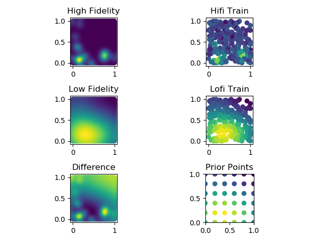

#### Runtime

- Logged in [australia9_output.txt](australia9_output.txt)

|Algorithm|Total Time (s)|Mean Time/Simulation with Multithreading (s)
|---|---|---|
|Todescato Null SF|3060.51|30.6|
|Todescato Human SF|3108.03|31.8|
|Todescato Human MF|4980.92|49.8|
|Choi Null SF|21834.20|218.3|
|Choi Human SF|19167.53|191.67|
|Choi Human MF|26120.65|261.2|
|Lloyd|191.35|1.91|
|Total|78463.34|112.09|

#### Discussion
- Exploring less and exploiting more will give the prior algorithms
a leg up AND reduce computation time
    - Less sampling --> information is more valuable
    - Majority of computational bottleneck in Choi is sample planning;
    reducing the amount of exploration will speed everything up
- Matching posterior variance of Todescato to Choi was a success and makes
for a fairer comparison; continue this
    - Consider normalizing prob_exploration in Todescato by n_agents
    to explore less
    - After running Todescato to see what posterior variance is, back-solve
    the doubling equation of Choi to determine how much variance
    must be reduced on each epoch
- Human prior points?
    - 36 gives a more uniform coverage than 9, and makes more sense in
    the context of 8 agents
    - Spaced every 0.2 is 10x spacing of test points at 0.02
- Consider alternative methods of lofi construction
    - Increase bandwidth smoothing? Currently set to 4x hifi
    - Add greater lofi sample noise?
    - Use gridded maxpooling to generate lofi?
    - Use SVD matrix compression to generate lofi?
    - Consider negative-correlation case in future work to contrast approaches
- Runtime notes
    - Add a runtime logging option to save runtimes to CSV
    - Use cProfiler to further pinpoint slow portions of algorithms
    - Consider looking into HPCC resources or other remote workstation options
    
#### Performance
    
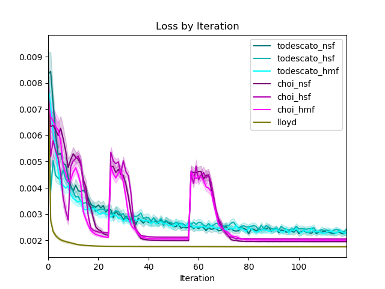

- MF model appears to perform the best overall
- HSF outperforms NSF early on by virtue of biased but approximately
correct prior information, but NSF outperforms HSF in the long run
as it incorporates no biased information
- Promising results - what I expected to see early on

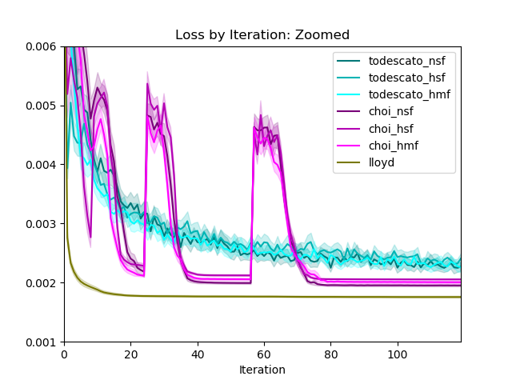

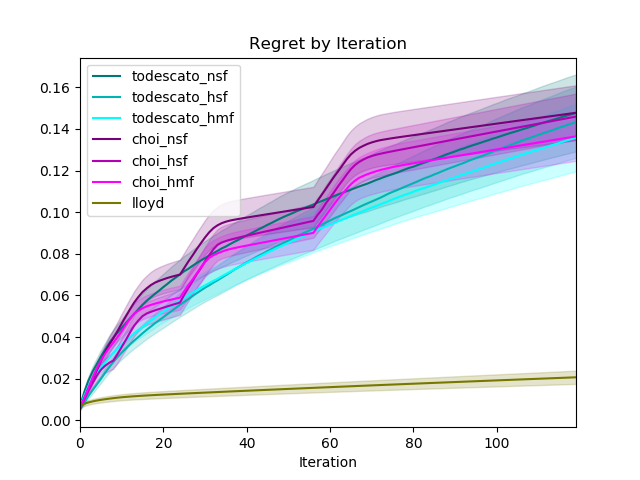

- Normalized WRT minimum loss configuration of Lloyd as zero
- Given that each algorithm now reaches approximately the same level
of posterior variance at the end, regret is comparable between algorithms
- MF model of each algorithm has lowest regret, followed by HSF then NSF
    - Again, proves the notion that good decisions early make a big impact 

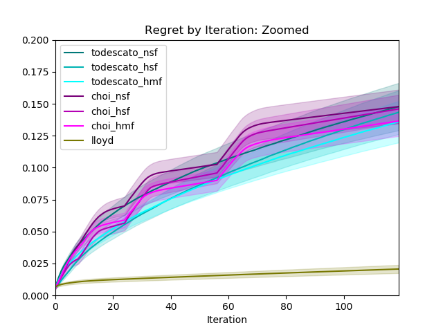

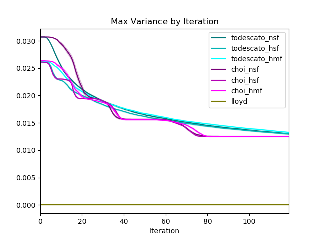

- Adjusted Choi threshold reduction scaling constant such that Choi
algorithms would reduce the variance as much as Todescato algorithms

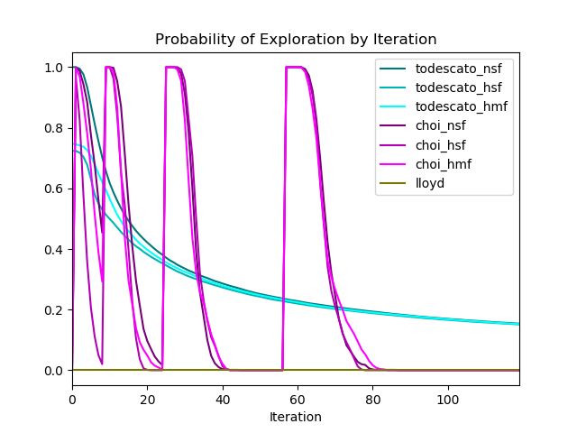

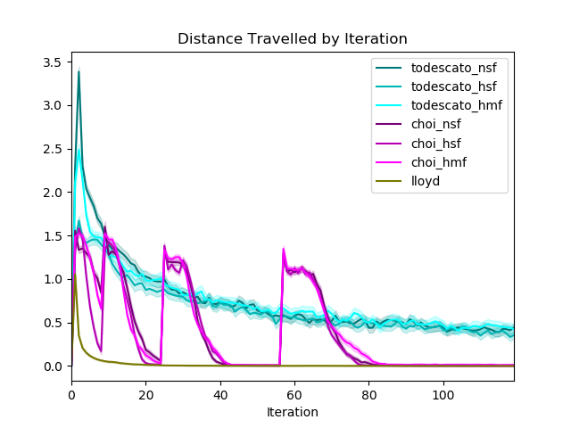

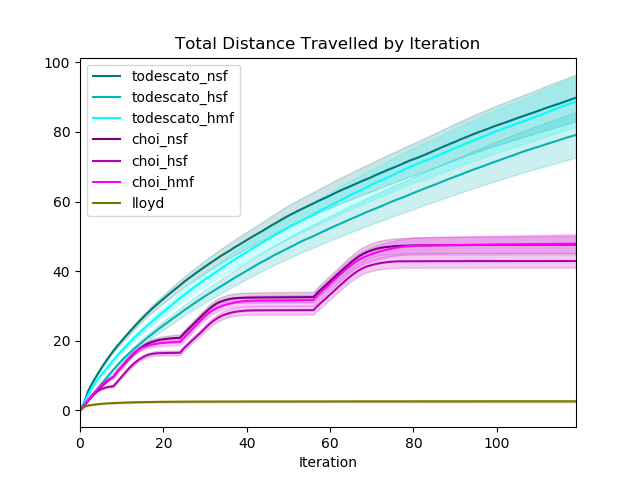

- As noted before, Choi is much more efficient in motion: if the swarm is
deployed in an environment in which motion is expensive, this is a 
strength to point out and consider
    - See http://nodes.ucsd.edu/sonia/papers/data/2007_AK-SM-cdc.pdf
- Across the fidelities, each algorithm seems to be clustered tightly, though
HSF is the most confident and thus samples and travels the least

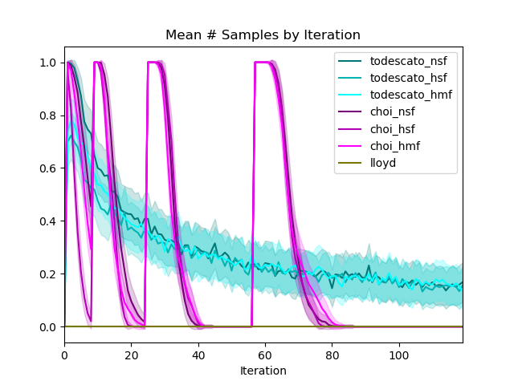

- Note: this is the mean number of samples/cumulative number of samples
by Iteration **PER AGENT** in each chart.
    - With n = 8 agents, then, approximately 30 * 8 = 240 samples were taken
- Interesting observation: Choi took slightly fewer cumulative samples in the 120 iterations,
 but reduced posterior variance slightly further than Todescato
    - Implies Choi is more efficient in motion and information gain?
    - Pre-planning helps each of these efficiencies

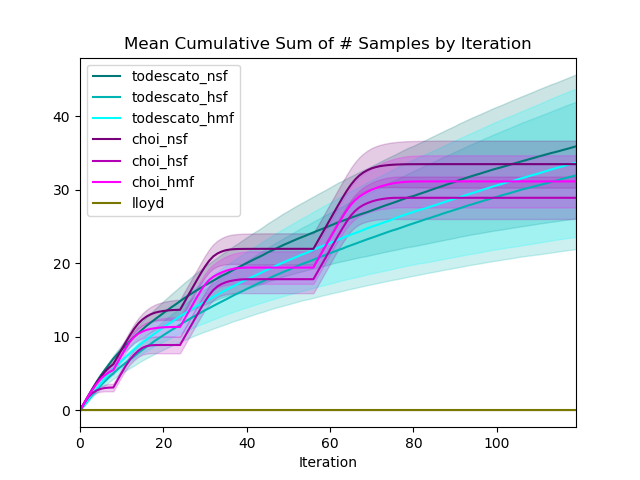

#### Configurations

- Did not save configuration images for this simulation, but could
easily generate

#### Follow-up

- Discuss at 7/7 research meeting